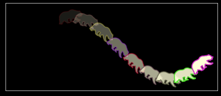

# Bear Sine Wave
cute bear sine wave animation! Only generates the frames; you have to glue them together (e.g. ffmpeg, handbrake, etc)

Here's a frame of it!

# Requirements
* numpy
* matplotlib
* pandas
* os
